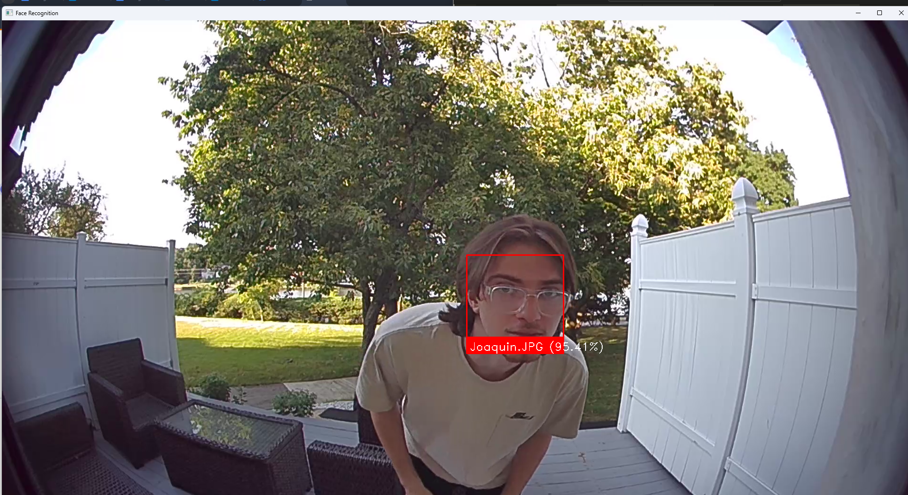

# Ring-Facial Recognition Project

## Table of Contents
- [Overview](#overview)
- [Features](#features)
- [Objectives](#objectives)
- [Tech Stack](#tech-stack)
- [images](#images)
- [Necessary Downloads](#neccecary-downloads)
- [How To Run](#how-to-run)
- [Issues and Solutions](#issues-and-solutions)
- [Possible-Improvements](#possible-improvements)
- [License](#license)

## Overview:
The Ring-Facial Recognition Project originally aimed to enhance home security by automatically recognizing family members from Ring doorbell footage and unlocking the door using an electric lock. This project was motivated by security concerns after the existing doorbell camera did not capture instances of attempted theft.

## Features 
- **Accesses Ring Footage**: Uses unofficial ring-doorbell-API to access your ring device and download the latest clips taken.
- **Facial Recognition**: Detects and recognizes faces from Ring camera footage.
- **Automatic Door Unlocking**: Integrates with an electric lock to unlock the door for recognized family members.

## Objectives
- The primary goal of this project was to have a way for family members or very close friends to access my home even if nobody is home and or they don't know the passkey to unlocking the Smartlock. 

## Architecture 
- Ring Doorbell API: Fetches the latest footage from Ring cameras using the unofficial Ring API.
- Facial Recognition: Analyzes video frames to detect and recognize faces using OpenCV and face_recognition library.
- Connects to the Seam API to control the electric lock based on a match in recognized faces.

## Tech-Stack
- Python: Programming language used for script development.
- OpenCV: Computer vision library for video processing.
- face_recognition: Library for facial recognition tasks.
- Requests: HTTP library for making API requests.
- Seam API: API used for controlling the electric lock.
- Ring Doorbell API: Used for fetching camera footage and data.

## Images:


## Neccecary-Downloads
```
- pip install opencv-python
- pip install face_recognition
- pip install requests
- pip install ring-doorbell
- pip install seam-api-client
- pip install numpy
```
- Make sure to install these packages in your Python environment before running your project scripts. If you encounter any specific issues during installation or usage, referring to each package's documentation or community resources can provide additional guidance.

## How-To-Run
- Once you have installed all the necessary packages in your Python environment, create and connect your Seam account to your smart lock account.
  
- Seam will provide you with an API key. Take note of this key and insert it into the Kwikset lock script, along with the device ID of the lock you want to control.
  
- Ensure you have created a folder named last_clip in your project directory. This folder will be used to store the latest video clip downloaded from your Ring camera.
  
- Edit the path in the facial recognition script to point to the last_clip folder where the downloaded video will be saved.
  
- Run the download_latest_clip.py script, and follow the steps to authorize your Ring account. This script will download the latest video clip from your Ring camera into the last_clip folder.
  
- Finally, run the main.py script to execute the entire program, which includes downloading the latest Ring clip, performing facial recognition, and unlocking the door if a match is found.

## Issues-and-Solutions
- **Issue**: The video file only loaded three frames due to incorrect color format.
- - **Solution**: Corrected frame color format to cv2.COLOR_BGR2RGB.

- **Issue**: Errors resulted from trying to access the live feed from the Ring camera (not available in the unofficial Ring API).
- - **Solution**: Modified script to download the latest clips and events recorded on both Ring devices.

- **Issue**: Difficulty exporting API Key for Seam/Kwikset lock connection.
- - **Solution**: Set the SEAM_API_KEY environment variable directly within the script.

## Additional Comments and Requirements
-  You must have a Ring Camera for this code to work, although facial recognition can theoretically run on most security cameras given you have access.
-  There are several limitations to this project that may affect its functionality under certain conditions.

## Possible-Improvements

- **Enhanced Facial Recognition Accuracy**: Increase the accuracy of facial recognition by augmenting the dataset with more diverse images of family members under different lighting conditions, angles, and expressions.
- **Real-time Processing**: Integrate live stream processing capabilities to analyze video feeds in real-time, providing immediate recognition and unlocking functionality.
- **User Interface Improvements**: Develop a web-based dashboard to monitor and control the system, view logs, and manage user permissions.

## License
- This project is licensed under the MIT License. You are free to use, modify, and distribute this software, provided that you include the original copyright notice and this permission notice in any copies or substantial portions of the software.

